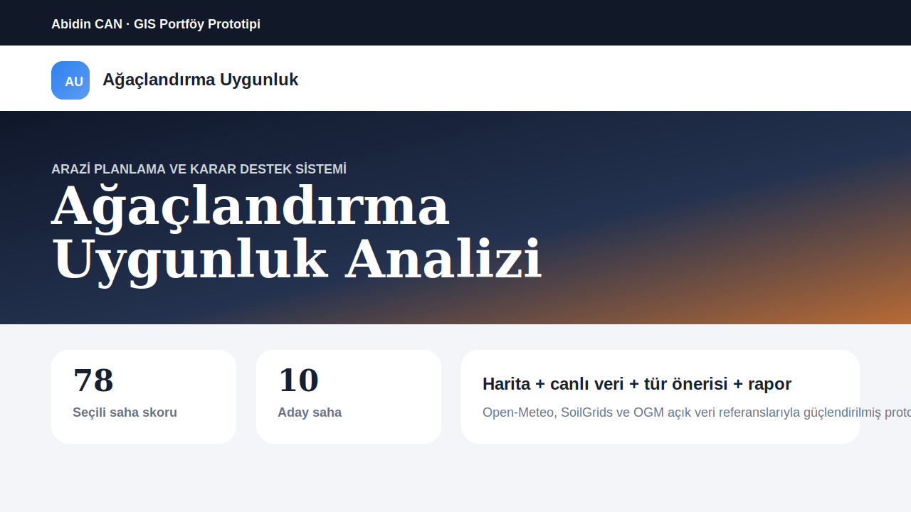
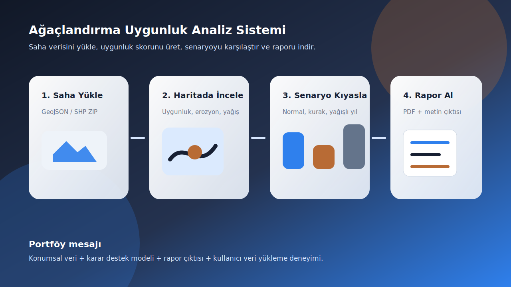

# Ağaçlandırma Uygunluk Analiz Sistemi

Çok kriterli arazi uygunluğu, tür önerisi, saha karşılaştırması ve uygulama fizibilitesi üreten GIS tabanlı karar destek prototipi.

Canlı demo: [cankhy.github.io/agaclandirma-uygunluk-analiz-sistemi](https://cankhy.github.io/agaclandirma-uygunluk-analiz-sistemi/)





Bu proje, ağaçlandırma planlamasını yalnızca haritada göstermeyen; arazi kriterlerinden uygunluk skoru, tür önerisi, uygulama zorluğu, saha takvimi ve rapor çıktısı üreten profesyonel bir portföy ürünüdür.

## Öne Çıkan Modüller

- Harita merkezli aday saha analizi
- Open-Meteo ile canlı hava göstergeleri
- ISRIC SoilGrids ile aktif saha toprak tahmini
- OGM açık orman varlığı referans veri paneli
- Uygunluk, erozyon, yağış ve erişim katmanları
- Normal yıl, kurak yıl ve yüksek yağış yılı senaryoları
- Eğim, bakı, yağış, toprak derinliği, erozyon ve erişim kriterleri
- Ayarlanabilir model ağırlıkları
- Ağaç türü öneri motoru
- Maliyet ve uygulama zorluğu tahmini
- Hazırlık, dikim, bakım ve izleme takvimi
- Saha öncelik matrisi ve karşılaştırmalı analiz
- İklim senaryosu kıyaslama paneli
- Veri güveni, bakım sınıfı ve tutma başarısı kontrol paneli
- GeoJSON ve SHP ZIP ile gerçek saha poligonu yükleme
- Tarayıcıda çalışan yerel saha veritabanı, dışa aktarma ve demo veriye dönme akışı
- Haritada standart/uydu altlığı değişimi
- Saha fotoğrafı veya uydu ekran görüntüsü ekleme
- Türkçe/İngilizce hızlı dil düğmesi
- Rapor metni indirme ve yazdırılabilir görünüm
- jsPDF ile PDF rapor oluşturma
- Tarayıcı önbelleği ile canlı servis çağrılarını azaltma
- SEO, manifest, sitemap, robots ve GitHub Pages yayını

## Kullanılan Teknolojiler

- HTML
- CSS
- JavaScript
- Leaflet
- GeoJSON
- GitHub Pages

## Çalıştırma

Projeyi doğrudan tarayıcıda açabilirsin:

```bash
index.html
```

Kalite kontrol:

```bash
npm run lint
```

## Veri Katmanı

- `data/afforestation-sites.geojson`: Aday ağaçlandırma sahaları ve saha kriterleri
- `data/ogm-public-forest-assets.json`: Resmî OGM orman varlığı sayfalarından derlenen açık referans kayıtları

Veri setinde farklı iklim, topoğrafya, erozyon ve erişim karakterlerine sahip örnek sahalar bulunur. Sahalar prototip amacıyla modellenmiştir.

Kullanıcı kendi GeoJSON veya SHP ZIP saha dosyasını yükleyebilir. Yüklenen saha verisi tarayıcıdaki yerel veritabanında saklanır, istenirse GeoJSON olarak dışa aktarılır veya demo veriye geri dönülür. GitHub Pages statik çalıştığı için sunucu tarafı veritabanı yerine portföye uygun, güvenli ve kurulumsuz bir istemci tarafı veri katmanı tercih edilmiştir.

## Gerçek Veri Kaynakları

- Open-Meteo Forecast API: canlı sıcaklık, nem, yağış ve rüzgâr göstergeleri
- ISRIC SoilGrids v2.0: aktif saha için pH, kil, kum ve organik karbon tahminleri
- Copernicus DEM: eğim/topografya analizi için referans sayısal yükseklik modeli
- CORINE Land Cover: arazi örtüsü ve kullanım sınıfları için referans katman
- OGM Orman Varlığı sayfaları: bölge müdürlüğü düzeyinde normal kapalı, boşluklu kapalı ve toplam orman varlığı referansları

Canlı servisler yanıt vermezse uygulama yerel GeoJSON verisiyle çalışmaya devam eder. Böylece demo yayında bozulmaz.

## Analiz Mantığı

Model dört ana kriter grubunu birlikte değerlendirir:

- Topografya: eğim ve bakı
- İklim: yıllık yağış ve senaryo etkisi
- Toprak: toprak derinliği ve erozyon riski
- Erişim: yol uzaklığı ve uygulama lojistiği

Bu kriterler kullanıcı tarafından değiştirilebilen ağırlıklarla tek uygunluk skoruna dönüştürülür. Tür öneri motoru, hedef tür grubu ve saha koşullarına göre önerileri sıralar.

## Karar Destek Çıktıları

- Senaryo kıyaslama: seçili sahanın normal yıl, kurak yıl ve yüksek yağış yılı skorlarını yan yana gösterir.
- Veri güveni: Open-Meteo, SoilGrids, OGM açık veri referansları ve yerel GeoJSON katmanlarının kullanılabilirliğini özetler.
- Tutma başarısı: uygunluk skoru ve bakım ihtiyacına göre ilk üç yıl başarı beklentisini üretir.
- Bakım sınıfı: standart, kontrollü veya yoğun bakım ihtiyacını saha bazında sınıflandırır.
- PDF raporu: skor, tür önerisi, senaryo kıyaslaması, kaynak güveni ve uygulama notunu tek dosyada toplar.

## GitHub Pages

Repo GitHub'a gönderildikten sonra `Settings > Pages` ekranında kaynak olarak `GitHub Actions` seçilir. `main` dalına yapılan push sonrası site otomatik yayın alır.

Canlı link:

```text
https://cankhy.github.io/agaclandirma-uygunluk-analiz-sistemi/
```

## Portföy Değeri

Bu repo şu mesajı verir:

> Konumsal veriyi sadece haritada göstermiyor; arazi kriterlerinden karar destek skoru, tür önerisi, uygulama takvimi ve rapor çıktısı üretebiliyor.

GIS, kamu teknolojileri, orman mühendisliği yazılımları, çevresel karar destek sistemleri ve arazi planlama projeleri için güçlü bir portföy parçası olacak şekilde hazırlanmıştır.

## Not

Bu çalışma resmî kurum uygulaması değildir. Demo sahaları ve skorlar portföy prototipi amacıyla modellenmiştir.
